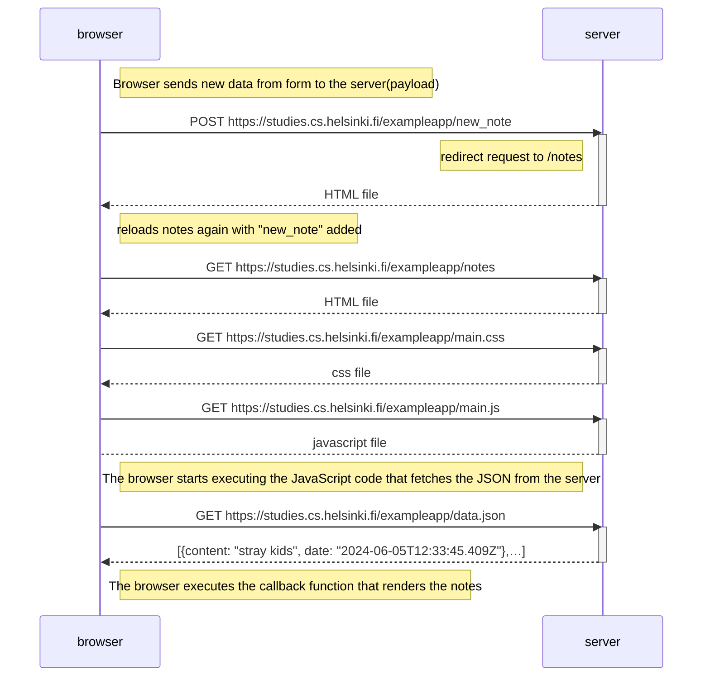

0.4 uusi muistiinpano

```mermaid
sequenceDiagram
    participant browser
    participant server

    Note right of browser: Browser sends new data from form to the server(payload)

    browser->>server: POST https://studies.cs.helsinki.fi/exampleapp/new_note
    activate server

    Note left of server: redirect request to /notes

    server-->>browser: HTML file
    deactivate server

    note right of browser: reloads notes again with "new_note" added
    
    browser->>server: GET https://studies.cs.helsinki.fi/exampleapp/notes
    activate server
    server-->>browser: HTML file
    deactivate server
    
    browser->>server: GET https://studies.cs.helsinki.fi/exampleapp/main.css
    activate server
    server-->>browser: css file
    deactivate server
    
    browser->>server: GET https://studies.cs.helsinki.fi/exampleapp/main.js
    activate server
    server-->browser: javascript file
    deactivate server

    Note right of browser: The browser starts executing the JavaScript code that fetches the JSON from the server
    
    browser->>server: GET https://studies.cs.helsinki.fi/exampleapp/data.json
    activate server
    server-->>browser: [{content: "stray kids", date: "2024-06-05T12:33:45.409Z"},…]
    deactivate server    

    Note right of browser: The browser executes the callback function that renders the notes 
```